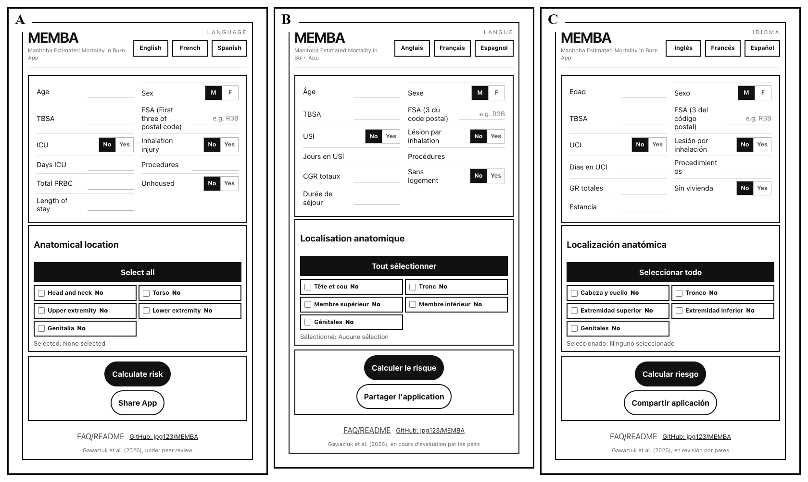
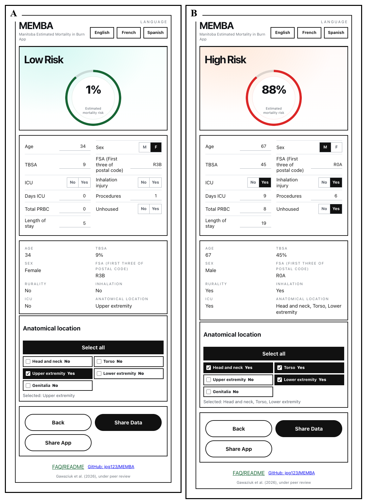

# MEMBER v1.0

## Manitoba Estimated Burn Mortality Risk

MEMBER is a research app that estimates inpatient mortality risk after a burn injury. It is designed to organize information in a consistent way and display the result as an estimated percentage.

It is for research, education and discussion. It does not replace clinical judgment, consultation with a burn team or local hospital protocols.

## Using the app

1. Select a language: English, French or Spanish. The app name remains MEMBER.
2. Enter the patient information available at the time of assessment.
3. Select the relevant anatomical locations.
4. Select **Calculate risk**.
5. Review the estimated mortality risk and the information entered.

The demonstration figures use Rule-of-Nines-compatible examples. The low-risk example uses 9% TBSA with one upper extremity selected. The high-risk example uses 45% TBSA from head and neck (9%), torso (18%) and one lower extremity (18%). The calculated-risk summary displays both TBSA and the selected anatomical locations.

## Submission examples

The following examples are the same image files used for the journal submission figures.

### Figure 3A-C MEMBA at-rest panels

A horizontal three-panel black-and-white composite shows the MEMBA application before a risk calculation: English in panel A, French in panel B and Spanish in panel C. Each panel has a border and shows the input fields, anatomical-location controls, disclosure, and the GitHub: jpg123/MEMBA link.

### Figure 4A-B MEMBA risk examples

A horizontal two-panel color composite shows a low-risk MEMBA example with 9% TBSA and the upper extremity selected in panel A and a high-risk example with 45% TBSA from head and neck, torso and lower extremity selections in panel B. Each panel has a border and the summary panel displays TBSA and the selected anatomical locations.

## Information used

The estimate uses:

- Age
- Sex
- Rurality derived from the first three characters of the postal code
- TBSA
- ICU use and ICU days
- Inhalation injury
- Anatomical location
- Housing status
- Procedures
- Length of stay
- Total packed red blood cell units

## How the estimate is produced

MEMBER uses a fitted logistic-regression model from the Manitoba burn registry study. The model combines the entered information, applies the weights estimated during model fitting and converts the combined result into an estimated mortality percentage.

The estimate is calculated as:

`Estimated mortality risk = 1 / (1 + exp(-combined model value))`

The combined model value starts with the model intercept and adds the contribution from each entered model variable. Each contribution is calculated by multiplying the processed patient value by the fitted coefficient for that variable. Positive contributions increase the estimated risk, while negative contributions decrease it. Age is represented using the model’s spline terms rather than a single straight-line age effect. Yes/no findings and anatomical locations are represented as indicator values. The logistic conversion changes the combined value, which is on a log-odds scale, into a number between 0 and 1; this number is displayed as a percentage.

Blank numeric fields use the median value from the model training cohort. Missing total packed red blood cell values are treated as zero because most patients did not receive transfusion.

## Sharing

- **Share App** opens MEMBER at rest in English.
- **Share Data** shares the selected low-risk or high-risk figure.
- On iPhone or iPad, the native share sheet can send the link through Messages or iMessage.
- On Android, native sharing depends on the browser and device. If it is unavailable, the app copies the link so it can be pasted into a message.

## What validation means here

The study used nested stratified cross-validation. This is internal validation, meaning that model performance was tested using repeated training and testing divisions within the study cohort.

External validation at another burn centre remains outstanding. The displayed estimate should therefore be interpreted in the context of the study cohort and not as a universal mortality probability.

## Project information

The application, fitted model and project documentation are maintained in the [MEMBA GitHub repository](https://github.com/jpg123/MEMBA).

The in-app **FAQ/README** provides the same user-facing information in a popup. Its content is currently maintained in English and will be translated after the English version is finalized.
